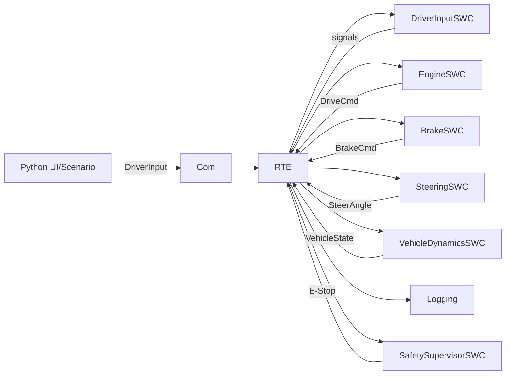

# SDV システムアーキテクチャ

## 1. 全体構成図

```
┌────────────────────────────────────────────────────────────────┐
│                     RTE (Runtime Environment)                  │
│  Global Signal Buffer (グローバル信号バッファ)                   │
│  ┌─────────────────────────────────────────────────────────┐  │
│  │ DriverInput          ActuatorCmd         VehicleState    │  │
│  │ ├─ throttle          ├─ drive_accel_cmd  ├─ t            │  │
│  │ ├─ brake             ├─ brake_decel_cmd  ├─ v            │  │
│  │ └─ steer             └─ steer_angle_cmd  ├─ yaw          │  │
│  │                                          ├─ x, y         │  │
│  │ Safety               (and more...)       └─ wheel_omega  │  │
│  │ ├─ estop                                                 │  │
│  │ └─ system_state                                          │  │
│  └─────────────────────────────────────────────────────────┘  │
└────────────────────────────────────────────────────────────────┘
                              ↑↓
        ┌─────────────────────────────────────────────────────┐
        │  SWC Layer (Software Component Layer)              │
        │                                                     │
        │  ┌──────────┐  ┌──────────┐  ┌──────────┐         │
        │  │Engine    │  │Brake     │  │Steering  │  ...    │
        │  │SWC       │  │SWC       │  │SWC       │         │
        │  └──────────┘  └──────────┘  └──────────┘         │
        │                                                     │
        └─────────────────────────────────────────────────────┘
                              ↑↓
        ┌─────────────────────────────────────────────────────┐
        │  Model Layer (Pure Functions / Physics)            │
        │                                                     │
        │  ┌────────────────┐  ┌────────────────┐           │
        │  │EngineModel     │  │BrakeModel      │  ...      │
        │  │ComputeDrive    │  │ComputeDecel    │           │
        │  │Accel()         │  │()              │           │
        │  └────────────────┘  └────────────────┘           │
        │                                                     │
        │  ┌────────────────┐  ┌────────────────┐           │
        │  │SteeringModel   │  │VehicleDynamics │           │
        │  │StepSteering    │  │StepLongitudinal│           │
        │  │Dynamics()      │  │StepLateral()   │           │
        │  └────────────────┘  └────────────────┘           │
        │                                                     │
        └─────────────────────────────────────────────────────┘
```

---

## 2. 層の責務分離

### SWC層（Software Component Layer）

**責務**:
- RTE から信号を読み取る
- Model層の関数を呼び出す
- 結果を RTE へ書き込む
- 周期的なタスク実行管理

**特徴**:
- RTE依存（I/O処理を行う）
- 状態管理（必要な場合、例：Steering）
- テスト困難（Mock RTE が必要）

### Model層（Pure Function Layer）

**責務**:
- 計算ロジック（数学・物理）を実行
- 入力から出力を生成

**特徴**:
- RTE非依存（純粋な計算）
- 副作用なし
- 容易にテスト可能（入出力のみ）
- 再利用可能

---

## 3. 各コンポーネントの責務

### Engine制御

```
Input:  throttle (0..1)   Output: drive_accel_cmd (m/s²)
        estop (bool)

Logic:
  if (estop):
    accel = 0.0
  else:
    accel = clamp(throttle) × max_accel_mps2

Model Function: ComputeDriveAccel(throttle, estop, params)
```

### Brake制御

```
Input:  brake (0..1)       Output: brake_decel_cmd (m/s²)
        estop (bool)

Logic:
  if (estop):
    decel = max_decel_mps2
  else:
    decel = clamp(brake) × max_decel_mps2

Model Function: ComputeBrakeDecel(brake, estop, params)
```

### Steering制御

```
Input:  steer (-1..1)      Output: steer_angle_cmd (rad)
        estop (bool)
        dt (s)

State: steer_angle_rad (current steering angle)

Logic:
  target = steer × max_steer_angle (if !estop)
  target = 0.0 (if estop)
  
  α = 1 - exp(-dt / τ)
  new_angle = current + α × (target - current)

Model Function: StepSteeringDynamics(current, target, tau, dt, params)
```

### Vehicle Dynamics

```
Input:  drive_accel_cmd (m/s²)
        brake_decel_cmd (m/s²)
        steer_angle_cmd (rad)
        estop (bool)

State:  v, x, y, yaw, yaw_rate, wheel_omega

Logic (Bicycle Model):
  Longitudinal:
    accel = drive - brake - drag
    if (estop): accel -= estop_decel
    v = clamp(v + accel×dt, 0, v_max)
    
  Lateral:
    yaw_rate = v / L × tan(δ)
    yaw += yaw_rate × dt
    x += v×cos(yaw)×dt
    y += v×sin(yaw)×dt

Model Functions:
  StepLongitudinal(state, dt, drive, brake, estop, params)
  StepLateral(state, dt, steer_angle, params)
```

---

## 4. テスト戦略

### Model層テスト

```
Pure Function Test (Catch2)

INPUT → [Pure Function] → OUTPUT
↓                          ↓
Deterministic         Verifiable
No side effects       No RTE dependency
```

**例**:
```cpp
TEST_CASE("Engine: throttle 0.5 → accel 1.0") {
    Model::EngineParams p{.max_accel_mps2 = 2.0f};
    float result = Model::ComputeDriveAccel(0.5f, false, p);
    REQUIRE(result == Approx(1.0f));
}
```

### SWC層テスト

```
Integration Test with Mock RTE (Catch2 + mock_rte.h)

Mock RTE Setup → SWC Main() → Output Verification
    ↓              ↓              ↓
Set Input      Call Model    Check RTE
Values         Functions     Output
```

**例**:
```cpp
TEST_CASE("EngineSWC: reads throttle, writes accel") {
    Mock_Rte_SetDriverInput({{throttle=0.5f}});
    Mock_Rte_SetSafety({{estop=false}});
    
    Swc::Engine::Main10ms(0.01);
    
    auto cmd = Mock_Rte_Written_ActuatorCmd();
    REQUIRE(cmd.drive_accel_cmd == Approx(1.0f));
}
```

---

## 5. 実行フロー

### 周期的実行（10ms）

```
TimeBase (10ms tick)
  ↓
  ├─→ DriverInputSWC::Main10ms() ─→ RTE.DriverInput update
  │
  ├─→ EngineSWC::Main10ms()
  │   ├─ RTE_Read_DriverInput()
  │   ├─ RTE_Read_Safety()
  │   ├─ Model::ComputeDriveAccel()
  │   └─ RTE_Write_ActuatorCmd()
  │
  ├─→ BrakeSWC::Main10ms()
  │   ├─ RTE_Read_DriverInput()
  │   ├─ RTE_Read_Safety()
  │   ├─ Model::ComputeBrakeDecel()
  │   └─ RTE_Write_ActuatorCmd()
  │
  ├─→ SteeringSWC::Main10ms()
  │   ├─ RTE_Read_DriverInput()
  │   ├─ RTE_Read_Safety()
  │   ├─ Model::StepSteeringDynamics()
  │   └─ RTE_Write_ActuatorCmd()
  │
  ├─→ VehicleDynamicsSWC::Main10ms()
  │   ├─ RTE_Read_ActuatorCmd()
  │   ├─ RTE_Read_VehicleState()
  │   ├─ Model::StepLongitudinal()
  │   ├─ Model::StepLateral()
  │   └─ RTE_Write_VehicleState()
  │
  ├─→ Logging::Main10ms()
  │   └─ RTE_Read_* & CSV output
  │
  └─→ Diag::Main10ms()
      └─ Signal sanity check
```

---

## 6. データフロー

```
Driver Input
    ↓
┌───┴─────────────────────────┐
│                             │
v                             v
EngineSWC                 SteeringSWC
  ↓                          ↓
drive_accel_cmd         steer_angle_cmd
  ↓                          ↓
  └─────────┬────────────────┘
            ↓
      BrakeSWC
            ↓
      brake_decel_cmd
            ↓
      ┌──────┴──────────────┐
      │                     │
      v                     v
VehicleDynamicsSWC    [Actuation System]
  ↓
[Updated State]
  v, x, y, yaw, ...
  ↓
  ├─→ Logging (CSV output)
  └─→ Safety Monitor (Heartbeat check)
```

---

## 7. クラス・構造体定義

### RTE Signal Structures

```cpp
// Driver Input
struct DriverInput {
    float throttle;      // 0..1
    float brake;         // 0..1
    float steer;         // -1..1
};

// Actuator Command
struct ActuatorCmd {
    float drive_accel_cmd;    // m/s²
    float brake_decel_cmd;    // m/s²
    float steer_angle_cmd;    // rad
};

// Vehicle State
struct VehicleState {
    float t;              // time (s)
    float v;              // velocity (m/s)
    float x, y;           // position (m)
    float yaw;            // yaw angle (rad)
    float yaw_rate;       // yaw rate (rad/s)
    float wheel_omega;    // wheel angular velocity (rad/s)
};

// Safety Status
struct Safety {
    bool estop;
    enum SystemState { Normal, Degraded, EStop } system_state;
};
```

### Model層 パラメータ構造体

```cpp
// Engine
struct EngineParams {
    float max_accel_mps2 = 2.0f;
};

// Brake
struct BrakeParams {
    float max_decel_mps2 = 4.0f;
    float estop_max_decel_mps2 = 4.0f;
};

// Steering
struct SteeringParams {
    float max_steer_angle_rad = 0.40f;
    float time_constant_s = 0.15f;
};

// VehicleDynamics
struct VehicleParams {
    float wheel_radius_m = 0.03f;
    float wheelbase_m = 0.20f;
    float linear_drag = 0.0f;
    float max_speed_mps = 3.0f;
    float estop_decel_mps2 = 6.0f;
};
```

  - SafetySupervisorSWC
- RTE
  - Rte_Read / Rte_Write（Signal Buffer）
  - Runnable dispatcher（タスク周期で呼び出す）
- BSW
  - TimeBase（dt、周期タスク）
  - Com（信号の外部入出力：v1はプロセス内、後でUDP）
  - Nvm(Config)（パラメータ永続化）
  - Diag/Watchdog（状態監視、ハートビート）
  - Logging（CSV、リプレイ）
- Platform
  - OS依存（時計、ファイル、ソケット等）抽象

## データフロー（v1）



## 実行形態

- v1: 単一プロセス（シンプルな周期スケジューラでRunnableを呼ぶ）
- v1+（拡張）: ComをUDP化し、UI/可視化を別プロセスへ分離
- v2: SWC差し替え（Control系など）をプロセス分離し更新対象へ

## 状態遷移（Safety）

- Normal: 通常動作
- Degraded: 一部異常（ログは継続、制限動作）
- EStop: 強制停止（出力無効、速度0へ収束）

EStopは「最優先」で、他のSWCの出力より常に上位で適用される。

## 物理モデル（v1）

v1は “それっぽさ” を優先し、最小の2Dモデルを採用する。

- 縦（速度）: エンジン駆動 + ブレーキ減速（飽和・一次遅れは任意）
- 横（旋回）: キネマティック・バイシクルモデル
- 車輪回転: v と半径 r から wheel_omega を算出（整合を維持）
