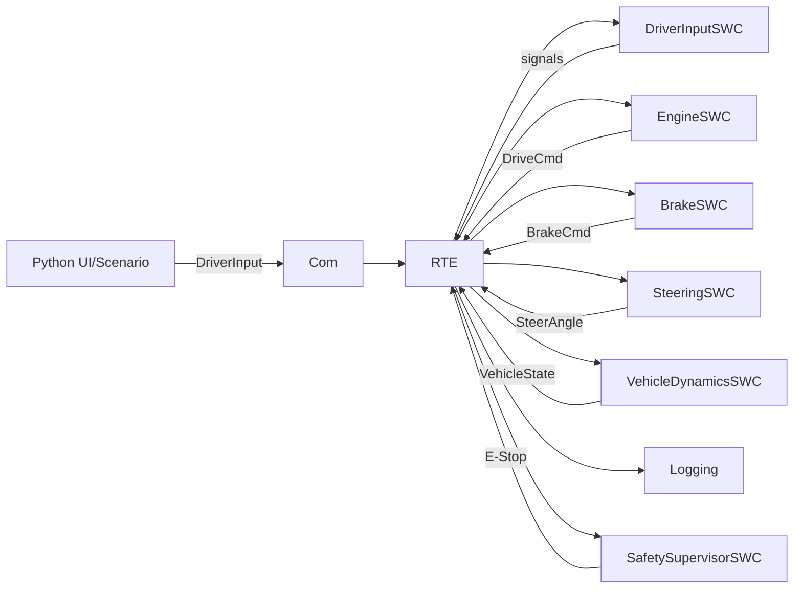

# 全体設計（Architecture）

## 層構造（AUTOSAR-like）

- Application Layer（SWC）
  - DriverInputSWC
  - EngineSWC
  - BrakeSWC
  - SteeringSWC
  - VehicleDynamicsSWC
  - SafetySupervisorSWC
- RTE
  - Rte_Read / Rte_Write（Signal Buffer）
  - Runnable dispatcher（タスク周期で呼び出す）
- BSW
  - TimeBase（dt、周期タスク）
  - Com（信号の外部入出力：v1はプロセス内、後でUDP）
  - Nvm(Config)（パラメータ永続化）
  - Diag/Watchdog（状態監視、ハートビート）
  - Logging（CSV、リプレイ）
- Platform
  - OS依存（時計、ファイル、ソケット等）抽象

## データフロー（v1）

## 実行形態

- v1: 単一プロセス（シンプルな周期スケジューラでRunnableを呼ぶ）
- v1+（拡張）: ComをUDP化し、UI/可視化を別プロセスへ分離
- v2: SWC差し替え（Control系など）をプロセス分離し更新対象へ

## 状態遷移（Safety）

- Normal: 通常動作
- Degraded: 一部異常（ログは継続、制限動作）
- EStop: 強制停止（出力無効、速度0へ収束）

EStopは「最優先」で、他のSWCの出力より常に上位で適用される。

## 物理モデル（v1）

v1は “それっぽさ” を優先し、最小の2Dモデルを採用する。

- 縦（速度）: エンジン駆動 + ブレーキ減速（飽和・一次遅れは任意）
- 横（旋回）: キネマティック・バイシクルモデル
- 車輪回転: v と半径 r から wheel_omega を算出（整合を維持）
