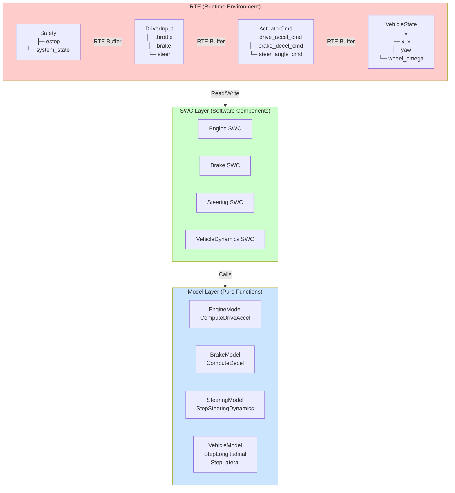
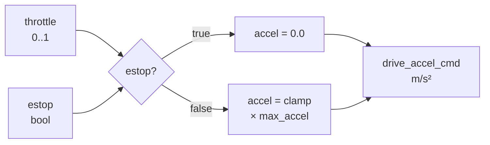
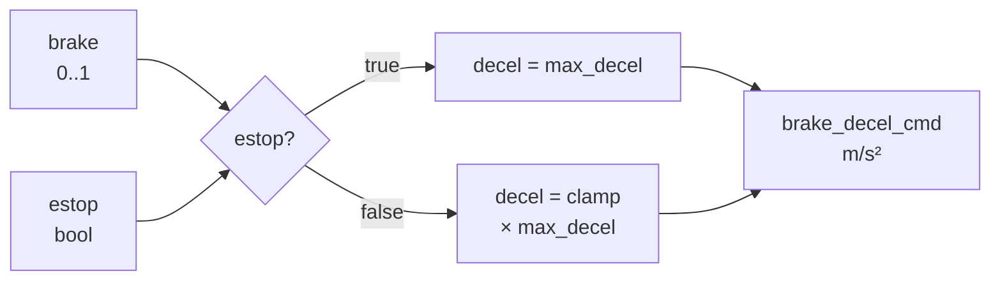
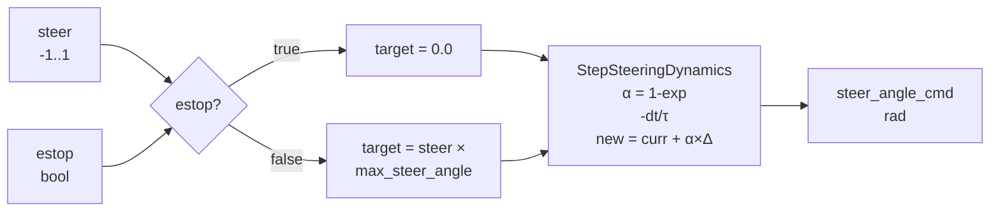
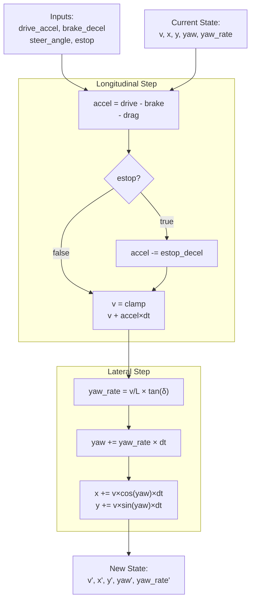
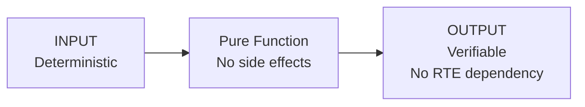
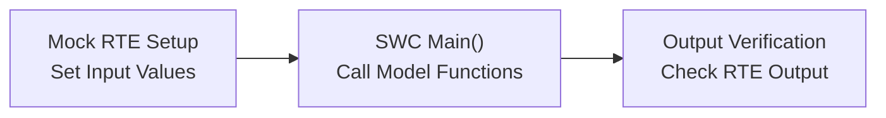
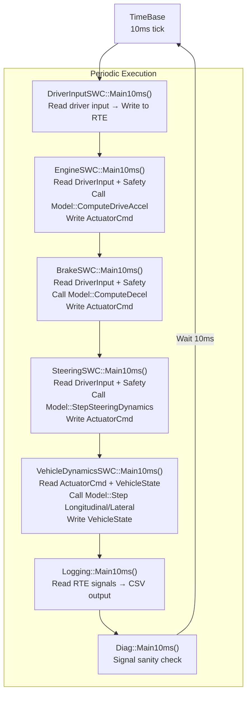
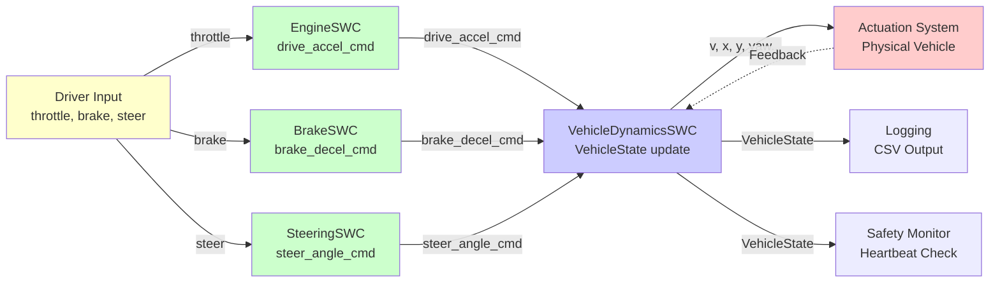

# SDV システムアーキテクチャ (Mermaid版)

## 1. 全体構成図



---

## 2. 層の責務分離

### SWC層（Software Component Layer）

**責務**:
- RTE から信号を読み取る
- Model層の関数を呼び出す
- 結果を RTE へ書き込む
- 周期的なタスク実行管理

**特徴**:
- RTE依存（I/O処理を行う）
- 状態管理（必要な場合、例：Steering）
- テスト困難（Mock RTE が必要）

### Model層（Pure Function Layer）

**責務**:
- 計算ロジック（数学・物理）を実行
- 入力から出力を生成

**特徴**:
- RTE非依存（純粋な計算）
- 副作用なし
- 容易にテスト可能（入出力のみ）
- 再利用可能

---

## 3. 各コンポーネントの責務

### Engine制御



**Model Function**: `ComputeDriveAccel(throttle, estop, params)`

### Brake制御



**Model Function**: `ComputeBrakeDecel(brake, estop, params)`

### Steering制御



**Model Function**: `StepSteeringDynamics(current, target, tau, dt, params)`

### Vehicle Dynamics



**Model Functions**:
- `StepLongitudinal(state, dt, drive, brake, estop, params)`
- `StepLateral(state, dt, steer_angle, params)`

---

## 4. テスト戦略

### Model層テスト



**例**:
```cpp
TEST_CASE("Engine: throttle 0.5 → accel 1.0") {
    Model::EngineParams p{.max_accel_mps2 = 2.0f};
    float result = Model::ComputeDriveAccel(0.5f, false, p);
    REQUIRE(result == Approx(1.0f));
}
```

### SWC層テスト



**例**:
```cpp
TEST_CASE("EngineSWC: RTE integration") {
    // Setup Mock RTE
    Rte::DriverInput driver_in{};
    driver_in.throttle = 0.5f;
    
    Rte::Safety safety{};
    safety.estop = false;
    safety.system_state = Rte::SystemState::Normal;
    
    Mock_Rte_SetDriverInput(driver_in);
    Mock_Rte_SetSafety(safety);
    
    // Execute SWC
    Swc::Engine::Main10ms(0.01);
    
    // Verify output
    auto cmd = Mock_Rte_Written_ActuatorCmd();
    REQUIRE(cmd.drive_accel_cmd == Approx(1.0f));
}
```

---

## 5. 実行フロー

### 周期的実行（10ms）



---

## 6. データフロー



---

## 7. クラス・構造体定義

### RTE Signal Structures

```cpp
// Driver Input
struct DriverInput {
    float throttle;      // 0..1
    float brake;         // 0..1
    float steer;         // -1..1
};

// Actuator Command
struct ActuatorCmd {
    float drive_accel_cmd;    // m/s²
    float brake_decel_cmd;    // m/s²
    float steer_angle_cmd;    // rad
};

// Vehicle State
struct VehicleState {
    float t;              // time (s)
    float v;              // velocity (m/s)
    float x, y;           // position (m)
    float yaw;            // yaw angle (rad)
    float yaw_rate;       // yaw rate (rad/s)
    float wheel_omega;    // wheel angular velocity (rad/s)
};

// Safety Status
struct Safety {
    bool estop;
    enum SystemState { Normal, Degraded, EStop } system_state;
};
```

### Model層 パラメータ構造体

```cpp
// Engine
struct EngineParams {
    float max_accel_mps2 = 2.0f;
};

// Brake
struct BrakeParams {
    float max_decel_mps2 = 4.0f;
    float estop_max_decel_mps2 = 4.0f;
};

// Steering
struct SteeringParams {
    float max_steer_angle_rad = 0.40f;
    float time_constant_s = 0.15f;
};

// VehicleDynamics
struct VehicleParams {
    float wheel_radius_m = 0.03f;
    float wheelbase_m = 0.20f;
    float linear_drag = 0.0f;
    float max_speed_mps = 3.0f;
    float estop_decel_mps2 = 6.0f;
};
```
