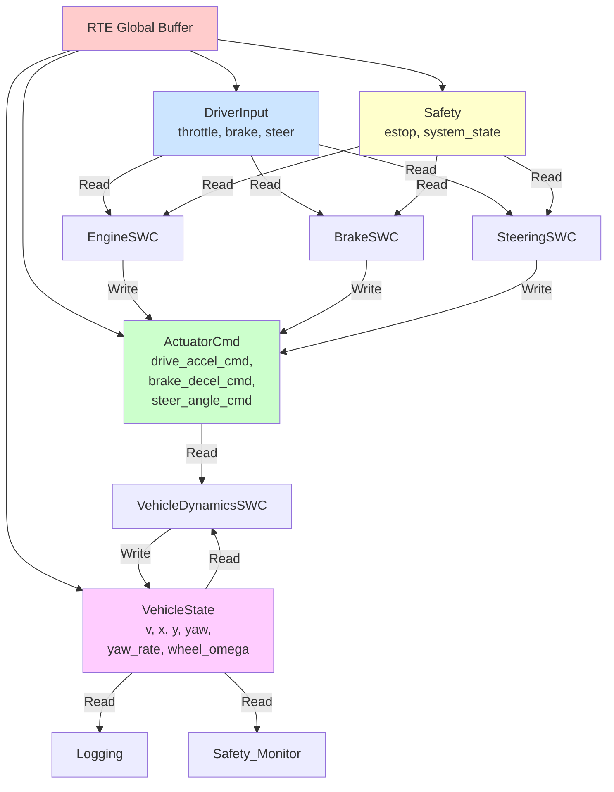
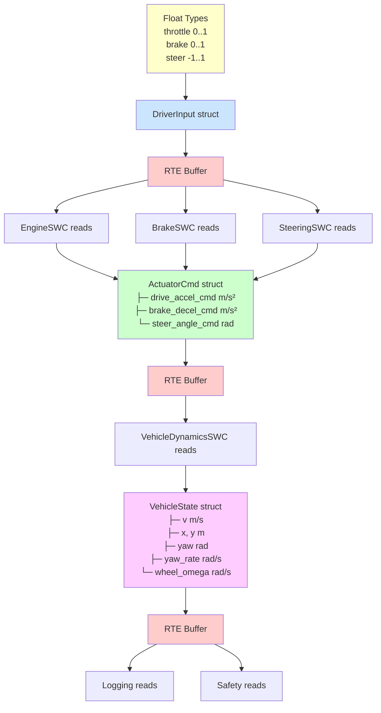

# UML Class Diagrams & Entity Relations (Mermaid版)

## 1. Model層 クラス図

```mermaid
classDiagram
    namespace Model {
        class EngineParams {
            float max_accel_mps2
        }
        class ComputeDriveAccel {
            <<pure_function>>
            float throttle_0_1
            bool estop
            const EngineParams& p
            returns float accel
        }
        
        class BrakeParams {
            float max_decel_mps2
            float estop_max_decel_mps2
        }
        class ComputeBrakeDecel {
            <<pure_function>>
            float brake_0_1
            bool estop
            const BrakeParams& p
            returns float decel
        }
        
        class SteeringParams {
            float max_steer_angle_rad
            float time_constant_s
        }
        class StepSteeringDynamics {
            <<pure_function>>
            float current
            float target
            float tau
            float dt
            returns float new_angle
        }
        
        class VehicleState {
            float t
            float v
            float x
            float y
            float yaw
            float yaw_rate
            float wheel_omega
        }
        class StepLongitudinal {
            <<pure_function>>
            VehicleState state
            float dt
            float drive
            float brake
            bool estop
            returns VehicleState
        }
        class StepLateral {
            <<pure_function>>
            VehicleState state
            float dt
            float steer_angle
            returns VehicleState
        }
        
        ComputeDriveAccel --> EngineParams : uses
        ComputeBrakeDecel --> BrakeParams : uses
        StepSteeringDynamics --> SteeringParams : uses
        StepLongitudinal --> VehicleState : updates
        StepLateral --> VehicleState : updates
    }
```

---

## 2. SWC層 クラス図

```mermaid
classDiagram
    namespace Swc {
        class EngineParams {
            float max_accel_mps2
        }
        class EngineSWC {
            -g_params: EngineParams
            +Init()
            +Main10ms(dt)
            +Version()
            --
            Actions:
            1. RTE_Read_DriverInput()
            2. RTE_Read_Safety()
            3. Model::ComputeDriveAccel()
            4. RTE_Write_ActuatorCmd()
        }
        
        class BrakeSWC {
            -g_params: BrakeParams
            +Init()
            +Main10ms(dt)
            +Version()
            --
            Actions:
            1. RTE_Read_DriverInput()
            2. RTE_Read_Safety()
            3. Model::ComputeBrakeDecel()
            4. RTE_Write_ActuatorCmd()
        }
        
        class SteeringParams {
            float max_steer_angle_rad
            float time_constant_s
        }
        class SteeringSWC {
            -g_params: SteeringParams
            -g_steer_angle: float*
            +Init()
            +Main10ms(dt)
            +Version()
            --
            Actions:
            1. RTE_Read_DriverInput()
            2. RTE_Read_Safety()
            3. Model::StepSteeringDynamics()
            4. RTE_Write_ActuatorCmd()
        }
        
        class VehicleParams {
            float wheel_radius_m
            float wheelbase_m
            float linear_drag
            float max_speed_mps
            float estop_decel_mps2
        }
        class VehicleDynamicsSWC {
            -g_params: VehicleParams
            +Init()
            +Main10ms(dt)
            +Version()
            --
            Actions:
            1. RTE_Read_ActuatorCmd()
            2. RTE_Read_VehicleState()
            3. Model::StepLongitudinal()
            4. Model::StepLateral()
            5. RTE_Write_VehicleState()
        }
        
        EngineSWC --> EngineParams : uses
        BrakeSWC --> BrakeParams : uses
        SteeringSWC --> SteeringParams : uses
        VehicleDynamicsSWC --> VehicleParams : uses
    }
```

---

## 3. RTE Signal依存関係



---

## 4. 実装パターン：Model層 vs SWC層

### Model層（src/model/*.h）- Pure Function Pattern

```cpp
namespace Model {
    // ============ Params ============
    struct EngineParams {
        float max_accel_mps2 = 2.0f;
    };
    
    // ============ Pure Function ============
    inline float ComputeDriveAccel(
        float throttle_0_1, 
        bool estop, 
        const EngineParams& p)
    {
        // No side effects
        // No global state modification
        // Deterministic: same input → same output
        
        if (estop) return 0.0f;
        float th = std::clamp(throttle_0_1, 0.0f, 1.0f);
        return th * p.max_accel_mps2;
    }
}
```

### SWC層（src/swc/*.cpp）- RTE I/O Pattern

```cpp
namespace Swc::Engine {
    static Model::EngineParams g_params{};
    
    void Init() {
        // One-time initialization
    }
    
    void Main10ms(double dt_s) {
        // ============ 1. RTE Read ============
        const auto in = Rte::Rte_Read_DriverInput();
        const auto sf = Rte::Rte_Read_Safety();
        auto cmd = Rte::Rte_Read_ActuatorCmd();
        
        // ============ 2. Prepare input ============
        bool estop = sf.estop || sf.system_state == Rte::SystemState::EStop;
        
        // ============ 3. Call Model ============
        cmd.drive_accel_cmd = Model::ComputeDriveAccel(
            in.throttle, 
            estop, 
            g_params
        );
        
        // ============ 4. RTE Write ============
        Rte::Rte_Write_ActuatorCmd(cmd);
    }
}
```

---

## 5. テスト層 Pattern

### Model層テスト（tests/test_engine_model.cpp）

```cpp
#include <catch2/catch_test_macros.hpp>
#include "model/engine_model.h"

TEST_CASE("EngineModel: basic computation") {
    Model::EngineParams p{.max_accel_mps2 = 2.0f};
    
    // Test case 1: normal operation
    float result = Model::ComputeDriveAccel(0.5f, false, p);
    REQUIRE(result == Approx(1.0f));
    
    // Test case 2: e-stop override
    result = Model::ComputeDriveAccel(1.0f, true, p);
    REQUIRE(result == 0.0f);
}
```

### SWC層テスト（tests/test_engine_swc.cpp + mock_rte.h）

```cpp
#include <catch2/catch_test_macros.hpp>
#include "mock_rte.h"
#include "swc/engine_swc.h"

TEST_CASE("EngineSWC: RTE integration") {
    // Setup Mock RTE
    Rte::DriverInput driver_in{};
    driver_in.throttle = 0.5f;
    
    Rte::Safety safety{};
    safety.estop = false;
    safety.system_state = Rte::SystemState::Normal;
    
    Mock_Rte_SetDriverInput(driver_in);
    Mock_Rte_SetSafety(safety);
    
    // Execute SWC
    Swc::Engine::Main10ms(0.01);
    
    // Verify output
    auto cmd = Mock_Rte_Written_ActuatorCmd();
    REQUIRE(cmd.drive_accel_cmd == Approx(1.0f));
}
```

---

## 6. 型と構造体の関係図


