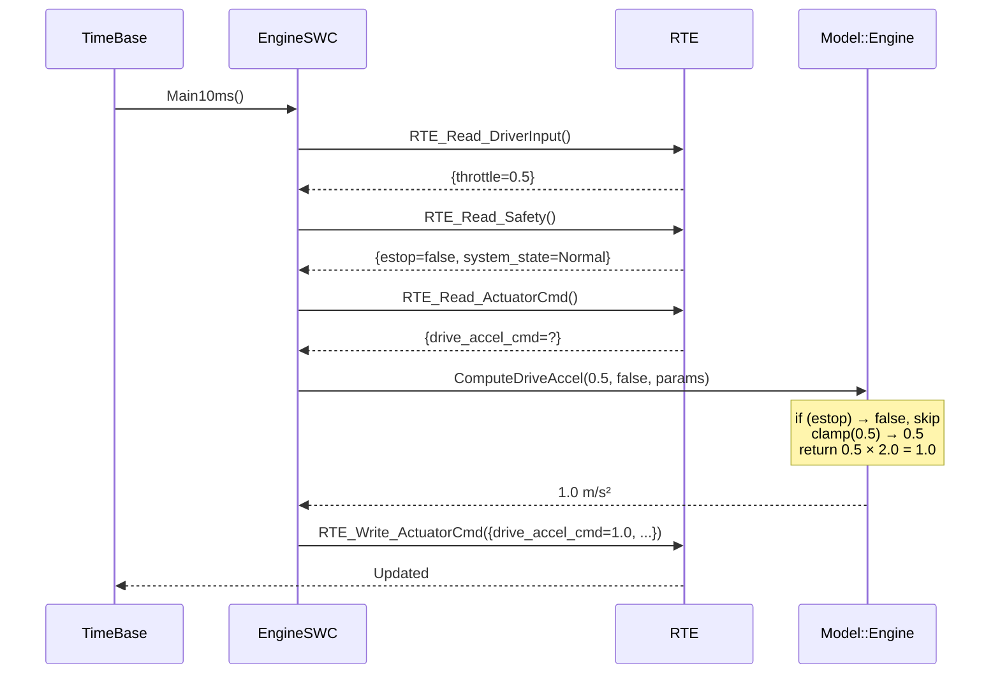
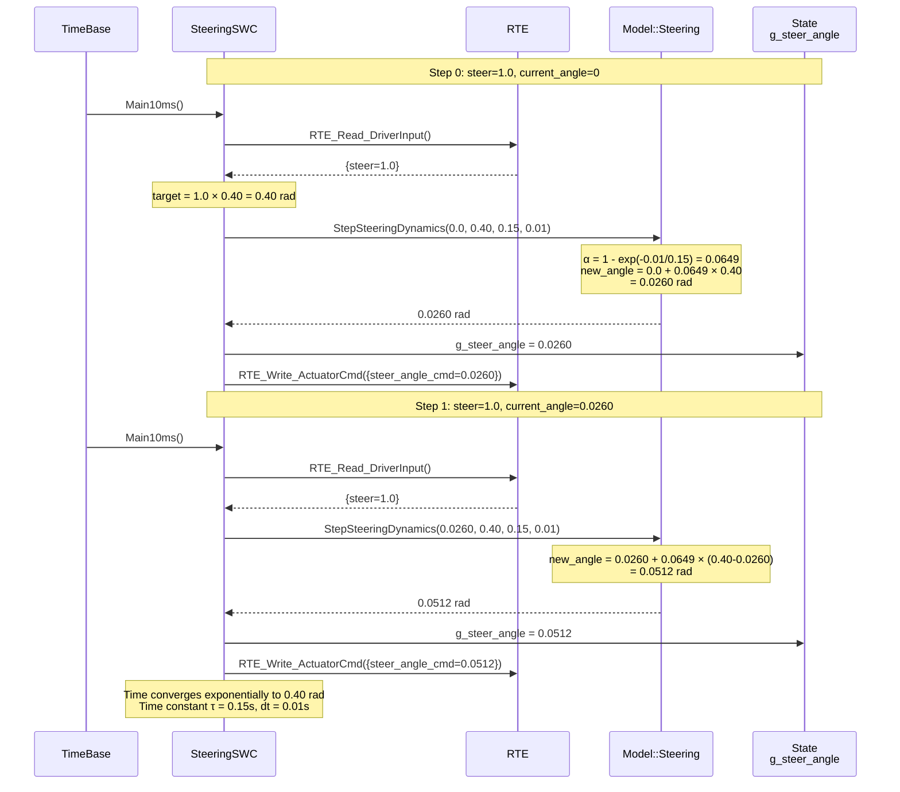
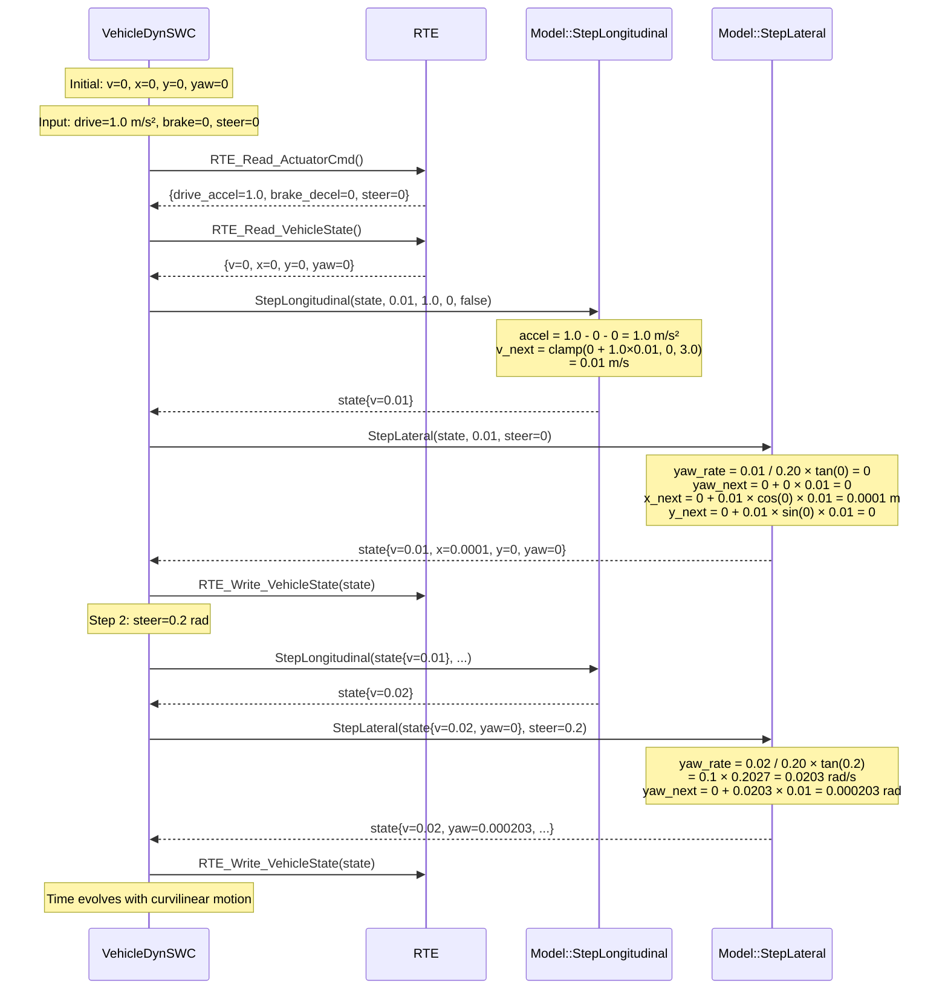
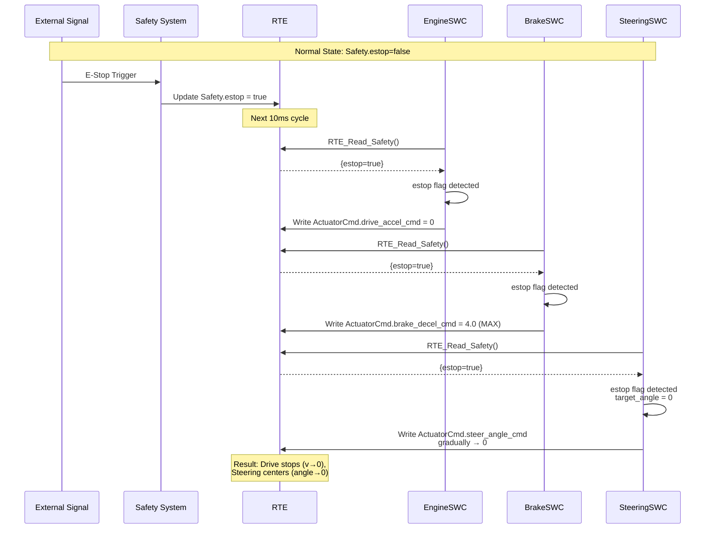
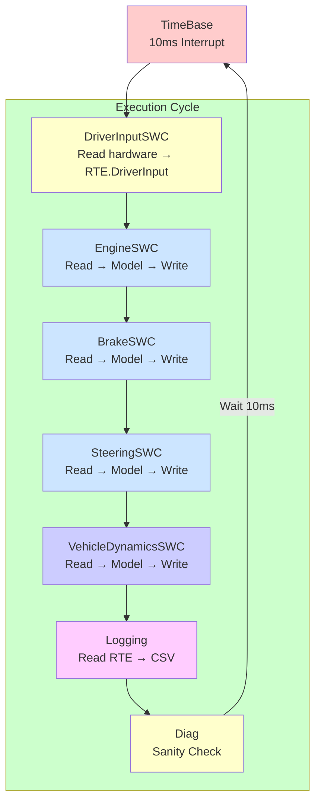
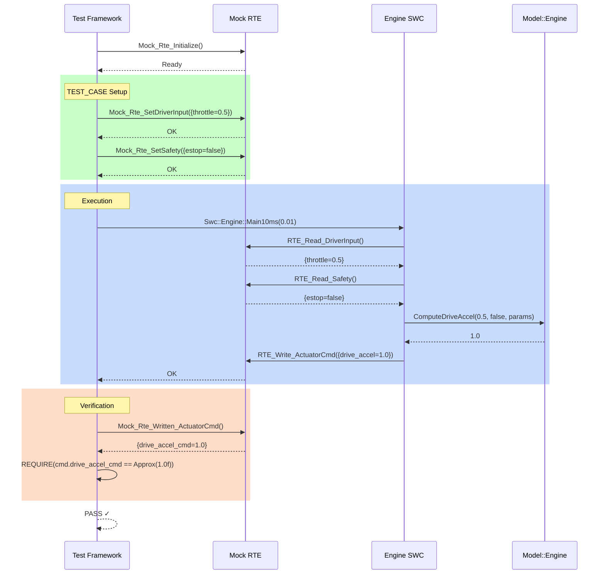

# Sequence Diagrams & Control Flow (Mermaid版)

## 1. Engine制御 シーケンス図（1ステップ）



---

## 2. Steering制御 シーケンス図（複数ステップ）



---

## 3. VehicleDynamics シーケンス図（複数ステップ）



---

## 4. E-Stop 発動時 シーケンス



---

## 5. 1周期実行フロー（10ms）



---

## 6. テスト実行フロー



---

## グラフ表現: Steering収束動作

```
steer_angle_cmd (rad)
  0.40 ├─────────────────  (target)
       │
  0.30 ├       ╱╱╱╱╱
       │   ╱╱╱╱
  0.20 ├╱╱╱
       │
  0.10 ├
       │
  0.00 └────────────────────── time (s)
       0    0.1   0.2   0.3  ...
       
時定数 τ = 0.15s
サンプリング周期 dt = 0.01s
```

---

## グラフ表現: VehicleDynamics軌跡

```
y (m)
  │
1 │           ╱╱╱╱
  │      ╱╱╱╱╱
  │  ╱╱╱╱
0 └──────────────── x (m)
  0   1   2   3   4

初期: 直進，その後ステア導入で曲線運動
v (m/s)
  3.0 ├─────────────────  (max_speed)
      │
  2.5 ├     ╱╱╱╱╱
      │╱╱╱╱╱╱
  2.0 ├╱╱╱╱
      │
  1.5 ├╱
      │
  0.0 └────────────────────── time (s)
      0    0.5   1.0  ...
      
加速後，最大速度で飽和
```
